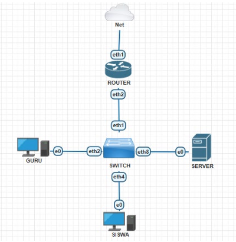

# Secure Network Infrastructure & Server Monitoring Lab

A network infrastructure and server monitoring implementation using MikroTik RouterOS and Debian Linux. This project demonstrates network segmentation, essential network services, web hosting, and infrastructure monitoring in a small enterprise environment.

---

## Network Topology



---

## Features

- VLAN Segmentation
- Router & Switch Configuration
- DHCP Configuration
- Static IP Addressing
- Firewall Filter Rules
- SSH Remote Access
- DNS Server (BIND9)
- Apache2 Web Server
- HTTPS with OpenSSL
- Cacti Network Monitoring

---

## Technology Stack

| Category | Technology |
|----------|------------|
| Router | MikroTik RouterOS v6 |
| Operating System | Debian 12 |
| Remote Access | OpenSSH |
| DNS Server | BIND9 |
| Web Server | Apache2 |
| SSL/TLS | OpenSSL |
| Monitoring | Cacti |

---

## Repository Structure

```text
.
├── README.md
├── .gitignore
├── configs
│   ├── mikrotik
│   │   ├── mikrotik-router.rsc
│   │   └── mikrotik-switch.rsc
│   ├── ssh
│   │   └── sshd_config
│   ├── bind9
│   │   ├── named.conf.local
│   │   ├── db.lab-smk.xyz
│   │   └── db.192.168.30
│   ├── apache2
│   │   ├── 000-default.conf
│   │   ├── default-ssl.conf
│   │   └── index.html
│   └── cacti
│       └── snmpd.conf
└── screenshots
    └── topology.png
```

---

## Configuration

Configuration files are organized by service to simplify navigation and deployment.

- MikroTik Router Configuration
- MikroTik Switch Configuration
- OpenSSH Server
- BIND9 DNS Server
- Apache2 Web Server
- OpenSSL
- Cacti Monitoring

---

## Project Purpose

This project was developed to demonstrate the implementation of a secure network infrastructure and server monitoring environment using MikroTik RouterOS and Debian Linux.

---

## Author

**Bayu (Pinkhat) Afrian**
